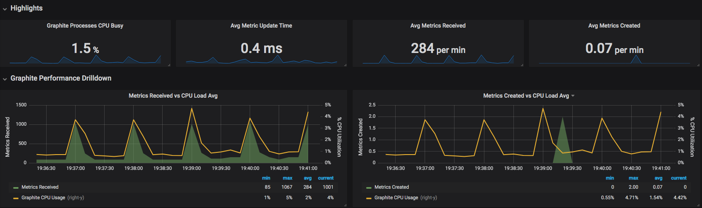
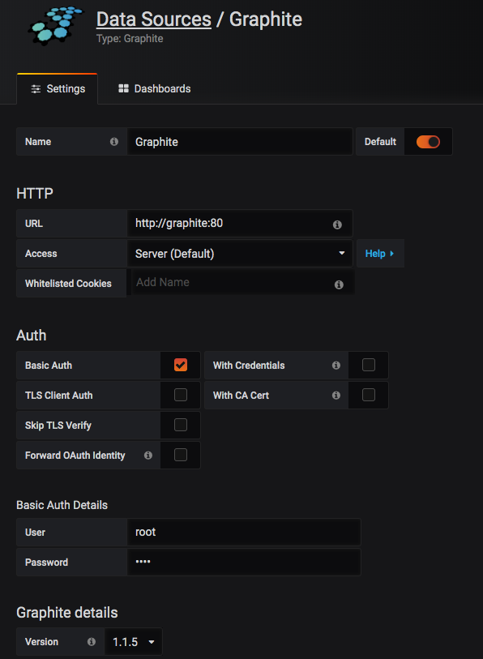

# Harvest Docker



* 他の言語で読む: [English](README.md)

## これはなに

1. NetApp HarvestをDocker化したもの
2. Dockerized Harvestをすぐに使えるようにGraphite/Grafanaも同時にセットアップするもの

## 前提条件

* Docker 18.06 がインストールされていること(稼働確認実施バージョン)
* makeがインストールされていること
* Grafna, Graphiteも同時に起動するComposeファイルを使用するため、
``docker-compose``がインストールされていること

## 現在の機能

ユーティリティスクリプトを使った次の機能を提供。

* HarvestのDocker image のビルド・プッシュ
* Harvest/Grafana/Graphiteのオールインワン起動

---

## イメージのビルド/プッシュ

使用するHarvest、NetAppMangeability sdk (NMSDK) はサービス規約への同意が必要となるため各自ダウンロードをして所定のディレクトリへ配置します。

配置先のディレクトリは以下の場所です。

* harvest/netapp-harvest_1.4.2_all.deb
* harvest/netapp-manageability-sdk-9.5.zip

もし、ベースOSのバージョンやHarvest,NMSDKのバージョンを変更する場合はMakefileの先頭の記述箇所を適宜変更してください。

Makefileの先頭に記載しているバージョンを使用してイメージのタグ付をしています。

ユーザ名(USER)についてはリポジトリ名に使用します。ビルド後にイメージ名を変更してもよいですが、この部分を書き換えておくとレジストリにプッシュする想定のイメージ名でdocker-composeファイル等を記載することができます。

``` Makefileの変更箇所
1 # bumpup version here.
2
3 VERSION            := 1.1
4 BASE_IMAGE         := ubuntu:16.04
5 HARVEST_VERSION    := 1.4.2
6 NMSDK_VERSION      := 9.5
7 USER               := makotow
```

コンテナイメージのビルドはMakeファイルを準備していますので、以下のコマンドを実行するとイメージｎビルドが開始します。

``` Dockerイメージのビルド
sudo make bi
```

イメージレジストリにプッシュする箇所もMakeファイルから実行できます。
ビルドが終わったら以下のコマンドを実行するとイメージレジストリへプッシュします。（今回はDockerHubを想定し、作成しています。）

```Docker push実行
sudo make pi
```

## ディレクトリ構成

``` Directory Layout
├── Makefile -> タスクランナー的な位置づけ
├── README.ja.md -> 本ドキュメント
├── README.md -> 英語版
├── docker-compose-dockervolume.yml -> Docker Volumeを使用したComposeファイル
├── docker-compose-volumemount.yml -> Volume mountを使用したComposeファイル
├── docker-compose.yml -> docker-compose-dockervolume.yml -> DockerVolume,VolumeMountいずれかへのシンボリックリンク
├── docker-vol -> Volume mount で実行した場合のデータ、コンフィグ置き場（一部Harvestの構成ファイルはVolume mount/Docker Volumeによらずこの場所を使用）
├── harvest -> HarvestのDocker化の実態
│   ├── Dockerfile
│   ├── entrypoint.sh
│   ├── netapp-harvest.conf
│   ├── netapp-harvest_1.4.2_all.deb -> サポートサイトからダウンロード
│   └── netapp-manageability-sdk-9.5.zip　-> サポートサイトからダウンロード
├── ./init.sh　-> Makeファイルの init タスクから呼び出される。
```

---

## docker化したHarvestの使い方について

ここでは``docker-compose``を使いHarvest、Grafana、Graphiteを構築するための事前準備、設定いついて記載します。

### 事前準備

``` Init
make init
```

初期化時にHarvestの構成ファイルが以下のパスにコピーされます。

* ${PWD}/docker-vol/harvest/harvest-netapp.conf

上記のファイルを編集します。ここではサンプルとして３点編集します。

### Grafana の設定

１点目はGrafanaのURL箇所です。`[global]`セクションの`grafana_url`を実際にGrafanaを起動するURLに変更します。ここでは`192.168.100.100`のホストの3000番ポートで起動すると定義しています。
このdocker-composeファイルを使用すると3000番ポートでGrafanaが起動します。

```Sample Configuration
1 [global]
2 # You will need to do this post install of grafana
3 # grafana_api_key   = CHANGE_GRAFANA_API_KEY
4 grafana_url       = http://192.168.100.100:3000
```

### Graphite の設定

２点目はデータを保管するGraphiteについてです。`[default]`セクションはGraphiteを起動するホストのIPを指定します。このDocker-composeを使用するとすべて同一ホストで実行するためGrafanaと同様のIPとなります。

（詳細はHarvestのドキュメントを参照ください。）

```Sample Configuration
6 [default]
7 graphite_server   = http://192.168.100.100
8 host_type         = FILER
9 # Filer auth ONTAPへの接続のクレデンシャル
10 username          = admin
11 password          = changepassword
```

### 監視対象の追加

３点目は監視対象のクラスタの追加です。設定ファイルにはクラスタごとにIPを登録します。

ここでは監視対象のONTAPクラスタを設定してください。

```Sample Configuration
12 [hostnname]
13 hostname   = 監視対象のONTAPのクラスタ管理IPまたはホスト名
14 site       = 任意の識別子
15 host_type  = FILER
16 group      = 任意の識別子　クラスタの識別に使用される
```

### Grafana/Graphite/Harvestを起動する

利便性を考え、収集したデータを保管する方法を２つ準備しています。それぞれでDocker-composeファイルを準備しています。

1. Docker Volume を使う方法（推奨）
2. Volume Mount を使う方法

初期状態では `1. Docker Volumeを使う方法` をdocker-compose.ymlへシンボリックリンクしています。用途に応じて変更ください。

なお、Harvestのコンフィグレーションは変更することも多いため、Volume Mountを採用しています。

Grafana,Graphite,Harvestを同時に起動するものもMakeファイルに準備しています。

起動するには以下のコマンドを実行します。

```Examples
sudo make compose-up
```

問題なく起動したら、以下のURLにアクセスします。

```Access URL
http://[harvest-netapp.confで指定したgrafana_url]:3000
```

正常にアクセスできるとGrafanaのログイン画面が表示されます。


admin/adminでログイン後パスワード変更実施しデータソースの設定を行います。

### GrafanaへデータソースであるGraphiteの登録

データソース登録画面で以下のように設定します。
環境によらず上記の `sudo make compose-up` で起動した場合は同様の設定になります。

まずはじめにデータソースの種別（Graphite)を選びます。


次に以下の通りデータソースの設定を行います。

URLは以下の画面の通りです。コンテナ内部からGraphiteでGraphiteコンテナへアクセスできます。

Accessは`Server`で実施します。

この例ではGraphiteへのアクセスはBasicAuthを使用しています。

Graphiteへのアクセスは初期設定で次の認証情報となります。

* user: root
* password: root

Graphiteのバージョンは`1.1.X`を選択してください。
保存後以下のスクリーンショットのように実際のバージョン(1.1.5)のような表記になります。



### Dashboardの登録

API経由で登録する場合はGrafanaからAPI Key を発行し、harvest-netapp.confに記載し、
harvestコンテナ内からImport処理を実施します。

ここではネットアップサポートサイトのツールチェストからダウンロードしたHarvest内に同梱されているダッシュボード(jsonファイル)を手動でインポートします。インポートはGrafanaのダッシュボードインポート機能を使用してください。

しばらくするとデータが貯まりはじまりグラフが見えてきます。

## References

1. [Grafana Labs: Installing using Docker](https://grafana.com/docs/installation/docker/)
2. [graphite-project/docker-graphite-statsd](https://github.com/graphite-project/docker-graphite-statsd)
3. [How To Install Graphite And Grafana: スレッドが非常にながく](https://community.netapp.com/t5/Data-Infrastructure-Management-Software-Articles-and-Resources/How-to-install-Graphite-and-Grafana/ta-p/109456/highlight/true)
4. [szukalski/docker-netapp-harvest: 先人の知恵をお借りしました。](https://github.com/szukalski/docker-netapp-harvest)

## Authors

* [@makotow](https://github.com/makotow)

## ライセンス

MIT
