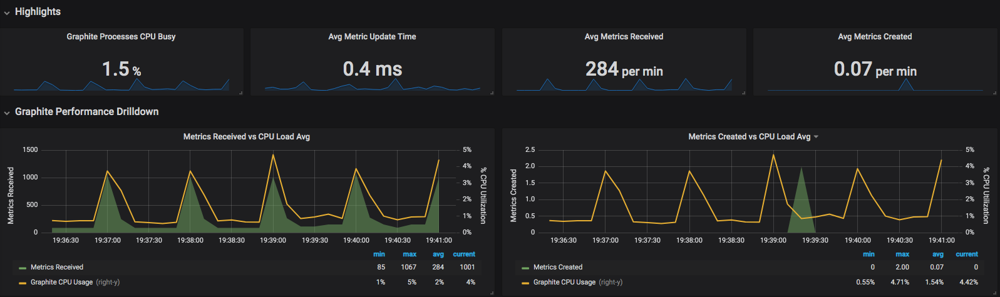
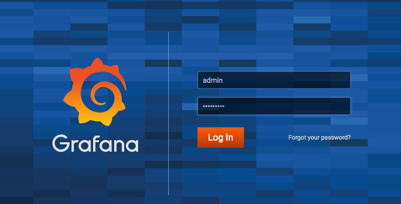
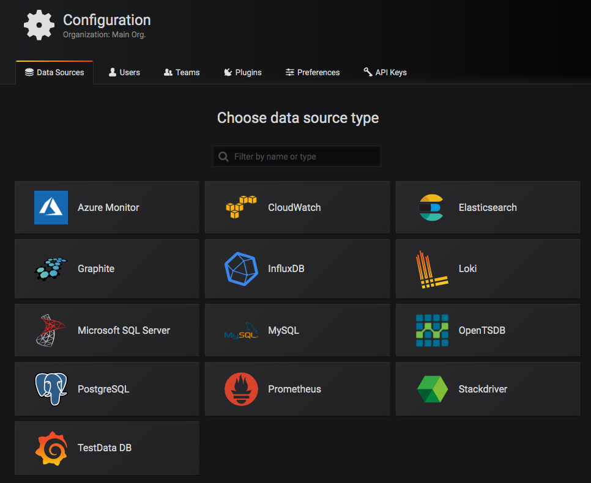
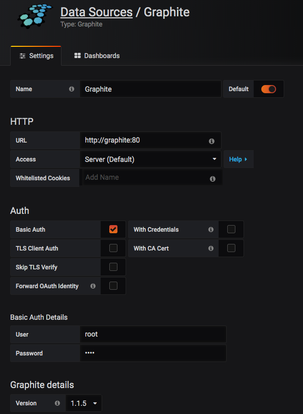

# Dockerized Harvest



*Read this in other languages: [日本語](README.ja.md)

## What is this?

1. Dockerized NetApp Harvest
2. Setting up Graphite / Grafana at the same time to use Dockerized Harvest immediately

## Prerequisites

* Docker 18.06 has been installed (Tested version)
* make has been installed
* Since Grafna and Graphite also use a Compose file to be launched simultaneously,
Need `docker-compose`

## Current features

Provides the following functions using utility script.

* Build / Push of Harvest Docker image
* All-in-one launch of Harvest / Grafana / Graphite

---

## Build / Push Image

The Harvest and NetAppMangeability SDK (NMSDK) used will need to be downloaded and placed in the designated directory, as agree to the terms of service is required.

The deployment destination directory is the following location.

* harvest/netapp-harvest_1.4.2_all.deb
* harvest/netapp-manageability-sdk-9.5.zip

If you change the version of the base OS or the version of Harvest or NMSDK, please change the description at the top of the Makefile accordingly.

The images are tagged using the version at Makefile.

The username (USER) is used for the image registry name. You may change the image name after the build, but if you rewrite this part, you can describe the docker-compose file etc. with the image name assumed to be pushed to the registry.

```Makefile changes
1 # bumpup version here.
2
3 VERSION: = 1.1
4 BASE_IMAGE: = ubuntu: 16.04
5 HARVEST_VERSION: = 1.4.2
6 NMSDK_VERSION: = 9.5
7 USER: = makotow
```

We provide utilities for container image build and push.
Execute the following command and beginning docker build.

``` Build a Docker image
sudo make bi
```

You can also push the image registry from the Makefile.
After the build is complete, execute the following command to push it to the image registry. (We assume DockerHub this time and make it.)

```Docker push execution
sudo make pi
```

## Directory structure

```Directory Layout
├── Makefile -> Task rnner
├── README.ja.md -> Japanese document
├── README.md -> this document
├── docker-compose-dockervolume.yml -> Compose file using Docker Volume
├── docker-compose-volumemount.yml -> Compose file using Volume mount
├── docker-compose.yml -> docker-compose-dockervolume.yml-> symbolic link to either DockerVolume or VolumeMount
├── docker-vol -> When using Volume mount, data and configuration storage area (some Harvest configuration files use this location regardless of Volume mount / Docker Volume)
├── harvest -> Dockerization of harvest
│   ├── Dockerfile
│   ├── entrypoint.sh
│   ├── netapp-harvest.conf
│   ├── netapp-harvest_1.4.2_all.deb -> Download from support site
│   └── netapp-manageability-sdk-9.5.zip　-> Download from support site
├── ./init.sh　-> It is called from init task of Makefile.
```

---

## How to use dockered Harvest

We describe preparation and configuration for building Harvest, Grafana and Graphite using `docker-compose`.

### Advance preparation

```Init
make init
```

Harvest's configuration file is copied to the following path during initialization.

* $ {PWD}/docker-vol/harvest/netapp-harvest.conf

Edit the above file. We will edit 3 points as a sample.

### Grafana Settings

The first point is the Grafana URL section. Change `grafana_url` in the `[global]` section to the URL that actually starts Grafana. It is defined that it starts with port 3000 of the host of `192.168.100.100`.
Using this docker-compose file will start Grafana on port 3000.

```Sample Configuration
1 [global]
2 # You will need to do this post install of grafana
3 # grafana_api_key = CHANGE_GRAFANA_API_KEY
4 grafana_url = http://192.168.100.100:3000
```

### Graphite Settings

The second point is about Graphite that stores data. The `[default]` section specifies the IP of the host running Graphite. If you use this Docker-compose, it will be the same IP as Grafana because it will all run on the same host.

(Please refer to the Harvest documentation for details.)

```Sample Configuration
6 [default]
7 graphite_server = http://192.168.100.100
8 host_type = FILER
9 # Filer auth credentials for connection to ONTAP
10 username = admin
11 password = changepassword
```

### Add Monitoring Target

The third point is to add a monitored cluster. Register the IP for each cluster in the configuration file.

Set the ONTAP cluster to be monitored.

```Sample Configuration
12 [hostnname]
13 hostname = cluster management IP or host name of ONTAP to be monitored
14 site = any identifier
15 host_type = FILER
16 group = any identifier used to identify clusters
```

## Start Grafana / Graphite / Harvest

For convenience, we have prepared two ways to store the collected data. Each prepares a Docker-compose file.

1. Docker Volume (recommended)
2. Volume Mount

By default, `1. Using Docker Volume` is symbolic link to docker-compose.yml. Please change according to the application.

In addition, since the configuration of Harvest(harvest-netapp.conf) is often changed, Volume Mount is adopted.

The utility script is provided to launch some service; Grafana, Graphite and Harvest.

Please change `image: makotow/harvest-docker:1.1-harvest1.4.2` section in docker-compose.yml if you change container name when building container image.

Execute the following command to start it.

```Examples
sudo make compose-up
```

If it starts without problems, access the following URL.

```Access URL
http://[grafana_url specified in harvest-netapp.conf]:3000
```

If you can access normally, Grafana login is displayed.



Change password after login with admin / admin and set data source.

### Register Graphite as a data source to Grafana

Make the following settings on the data source registration screen.

First select the type of data source (Graphite).



Next, configure the data source as follows.

The URL is as follows. You can access Graphite container with "Graphite" from inside the container.

Access is specified by `Server`.

In this example, Graphite access uses BasicAuth.

Access to Graphite will be the following authentication information by default.

* user: root
* password: root

Please select `1.1.X` for the Graphite version.
After saving, it will be described as the actual version (1.1.5) like the screenshot below.



### Registering Dashboard

When registering via API, issue an API Key from Grafana and describe it in harvest-netapp.conf, and import processing from within the harvest container.

In this document, we manually import the dashboard (json file) included in the Harvest downloaded from the tool chest of the NetApp Support Site. For import, use Grafana's dashboard import function.

After a while, the data is collected and the graph starts to appear.

## References

1. [Grafana Labs: Installing using Docker](https://grafana.com/docs/installation/docker/)
2. [graphite-project/docker-graphite-statsd](https://github.com/graphite-project/docker-graphite-statsd)
3. [How To Install Graphite And Grafana: Very Long Threads](https://community.netapp.com/t5/Data-Infrastructure-Management-Software-Articles-and-Resources/How-to-install-Graphite-and-Grafana/ta-p/109456/highlight/true)
4. [szukalski/docker-netapp-harvest: I borrowed the wisdom of my predecessor.](https://github.com/szukalski/docker-netapp-harvest)

## Authors

* [@makotow] (https://github.com/makotow)

## License

MIT